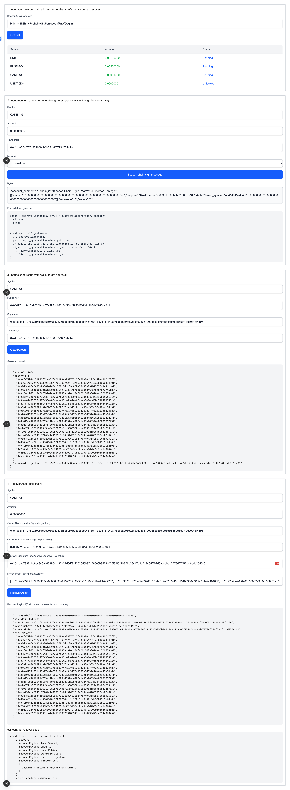

# Token Recover Self-Service Tools

A self-service web tool for recovering BEP2/BEP8 tokens from BNB Beacon Chain to [BNB Chain (BSC)](https://www.bnbchain.org/en/bnb-smart-chain).

## Overview

After the BNB Beacon Chain sunset, users can recover their tokens to BSC using this self-service tool. The process follows a 4-step guided flow:

1. **Query tokens** - Enter your Beacon Chain address to see recoverable tokens.
2. **Sign message** - Generate a sign message and sign it with your Beacon Chain wallet (e.g., Trust Wallet).
3. **Get approval** - Submit the signed data to the server to receive merkle proofs and an approval signature.
4. **Recover on BSC** - Use the generated payload to call the BSC recovery smart contract.

## Prerequisites

- Node.js >= 22.0.0
- npm, yarn, pnpm, or bun

## Getting Started

1. Clone the repository:

```bash
git clone https://github.com/bnb-chain/token-recover-self-service-tools.git
cd token-recover-self-service-tools
```

2. Install dependencies:

```bash
npm install
```

3. (Optional) Configure the API endpoint by creating a `.env.local` file:

```bash
cp .env.example .env.local
```

4. Start the development server:

```bash
npm run dev
```

5. Open [http://localhost:3000](http://localhost:3000) in your browser.

> **⚠️ NOTICE:** Please strictly follow the steps on the page to perform recovery. Before proceeding, you can read the example below and check the screenshots.

## Step-by-Step Recovery Example (BSC Mainnet)

> **Note:** The addresses, signatures, and keys below are from a team-controlled test wallet for demonstration purposes only. They do not represent real user data.

This guide demonstrates how to recover assets from Beacon Chain to BSC mainnet using a real example.

## 1. Input your beacon chain address to get the list of tokens you can recover
Address: `bnb1nn3h8hm678shs5vxj8a5enjes0uhf7nwf0wq4m`
## 2. Input recover params to generate sign message for wallet to sign(beacon chain)
Params:
- Symbol: `CAKE-435`
- Amount: `0.00001000`
- ToAddress: `0x441DE55A37F6C381b00Db8B52DF8f57794784a1A`
- Network: `bbc-mainnet`

=>

- Need Signed message:
```
{"account_number":"0","chain_id":"Binance-Chain-Tigris","data":null,"memo":"","msgs":[{"amount":"00000000000000000000000000000000000000000000000000000000000003e8","recipient":"0x441de55a37f6c381b00db8b52df8f57794784a1a","token_symbol":"43414b452d343335000000000000000000000000000000000000000000000000"}],"sequence":"0","source":"0"}
```

=>
- signature by trust wallet
```
{"signature":"0xe4838ff411975a210cb15d5c950b53835f5d5bb7b0ebb8dbc4515541bb01181e408f7cbbdab08c9278a623667909e8c3c39fee8c3df65de65df4aec0c48f4196","publicKey":"0x030771d42cc0a93289bf457e575bdb42c0d56fcf5953df6614b1b7de2986ce941c"}
```
## 3. Input signed result from wallet to get approval
Params:
- Symbol: `CAKE-435`
- Public Key: `0x030771d42cc0a93289bf457e575bdb42c0d56fcf5953df6614b1b7de2986ce941c`
- Signature: `0xe4838ff411975a210cb15d5c950b53835f5d5bb7b0ebb8dbc4515541bb01181e408f7cbbdab08c9278a623667909e8c3c39fee8c3df65de65df4aec0c48f4196`
- To Address: `0x441DE55A37F6C381b00Db8B52DF8f57794784a1A`

=>
Server Approval(bbcApproval):
```
{
  "amount": 1000,
  "proofs": [
    "0x9efa77b9dc22966f52aa6ff000d93e9952755d3fe50a80d29fa12bed8b7c72f3",
    "0xb3621bd62b4f2a63905156c4e619a07b2448cb95103966af915e2b1e9c48460f",
    "0x97d4ce96c0a85b03867e9d3ad368c7dcc89d85ba58f83b29fb15320d3a44cc09",
    "0x24a85c13aab3b800fafd99a0a7652362d91ebc64b88afdd665ab0a7de07a5f89",
    "0x0cfecdb47bd8a7ff5b202cec419087acafed14af606c642a8678e4b7066784e7",
    "0x00b6f73d6f808716ad044ec2907e5e76c9c307861938f88e7cd16c5d8a6e191b",
    "0x84ee87a475274d27e56ea884ecaa951edbe2ea064aaa6e1ebd3bc71b40d356ce",
    "0xc27d7b349d4edae64c4f787e73376d50c45ed2603c1448e65ff6bbdfbfd452ab",
    "0xa8a21aa4606999c9945b026e4e697d7bad972cbdfca38ec333b33418eec7dd9f",
    "0x9d630045fae75e2f621f33e628d774f657f6d22334009b074fc2b151ab874a80",
    "0xaf8ad17213314d6b07a91e077f0ba2945b3278d1532a5d837418a6ae42a74bda",
    "0x36ea9c3168e15d35bb0ac43653f7b816378d9dd5412ccb4bc62e2de9c333224f",
    "0xdc8f3cd1616d99e763e11bddc4308cd357abe986a1a33a088546e88036667937",
    "0xbedb72938961fea16f64b076065ed2b91fa25fb2bf984f553c03d48bc569c033",
    "0xefa877fa333d6d75c3da0ef13821e3cd9685950cee49595c02fc99e08e233d19",
    "0xfe907ad6ca4dac9691979e957a149e7255f52cce71dc29bdfbedfdce418cfb59",
    "0xeda25fcca6845187f69c1e497117e96d31d510f2a0b4eb467802930ea07e621e",
    "0x08e48c160cddfec6baad859aa773c0ceb96e3b96f7e7494368e5d7cc58925a17",
    "0xd00ba81ed2beebb3504520d12099764e1d1d138c7ff0b9718de33815b1efdb6b",
    "0x04159fc633d65231a885033c82e7b5f0e8cf718a83b814c3813af228cac32601",
    "0x266ed87d80982b796b09c5c24686e7e22b9230dd0c45eb1d7b59c2aa1a9f44ec",
    "0xa5dc142647d49c5c7680cc680ccc64ab0c7d7ab12e05bf0590e9503e4c03afd1",
    "0xbaca08c850752d636fc44d1d17d809763186547beafdd0736d79ac9544378252"
  ],
  "approval_signature": "0x25f1baa7988bbe8b49c6a163396cc137a37d6df911352655b97176060b9573c006f3f5527b856b38417e2d519465f752d0abcebde7778df774f7e4fccdd2556c01"
}

```

## 4. Recover Asset(bsc chain)
params:
- Symbol: `CAKE-435`
- Owner Signature (bbcSigned.signature): `0xe4838ff411975a210cb15d5c950b53835f5d5bb7b0ebb8dbc4515541bb01181e408f7cbbdab08c9278a623667909e8c3c39fee8c3df65de65df4aec0c48f4196`
- Owner Public Key (bbcSigned.publicKey): `0x030771d42cc0a93289bf457e575bdb42c0d56fcf5953df6614b1b7de2986ce941c`
- Approval Signature (bbcApproval.approval_signature): `0x25f1baa7988bbe8b49c6a163396cc137a37d6df911352655b97176060b9573c006f3f5527b856b38417e2d519465f752d0abcebde7778df774f7e4fccdd2556c01`
- : Merkle Proof (bbcApproval.proofs): `[     "0x9efa77b9dc22966f52aa6ff000d93e9952755d3fe50a80d29fa12bed8b7c72f3",     "0xb3621bd62b4f2a63905156c4e619a07b2448cb95103966af915e2b1e9c48460f",     "0x97d4ce96c0a85b03867e9d3ad368c7dcc89d85ba58f83b29fb15320d3a44cc09",     "0x24a85c13aab3b800fafd99a0a7652362d91ebc64b88afdd665ab0a7de07a5f89",     "0x0cfecdb47bd8a7ff5b202cec419087acafed14af606c642a8678e4b7066784e7",     "0x00b6f73d6f808716ad044ec2907e5e76c9c307861938f88e7cd16c5d8a6e191b",     "0x84ee87a475274d27e56ea884ecaa951edbe2ea064aaa6e1ebd3bc71b40d356ce",     "0xc27d7b349d4edae64c4f787e73376d50c45ed2603c1448e65ff6bbdfbfd452ab",     "0xa8a21aa4606999c9945b026e4e697d7bad972cbdfca38ec333b33418eec7dd9f",     "0x9d630045fae75e2f621f33e628d774f657f6d22334009b074fc2b151ab874a80",     "0xaf8ad17213314d6b07a91e077f0ba2945b3278d1532a5d837418a6ae42a74bda",     "0x36ea9c3168e15d35bb0ac43653f7b816378d9dd5412ccb4bc62e2de9c333224f",     "0xdc8f3cd1616d99e763e11bddc4308cd357abe986a1a33a088546e88036667937",     "0xbedb72938961fea16f64b076065ed2b91fa25fb2bf984f553c03d48bc569c033",     "0xefa877fa333d6d75c3da0ef13821e3cd9685950cee49595c02fc99e08e233d19",     "0xfe907ad6ca4dac9691979e957a149e7255f52cce71dc29bdfbedfdce418cfb59",     "0xeda25fcca6845187f69c1e497117e96d31d510f2a0b4eb467802930ea07e621e",     "0x08e48c160cddfec6baad859aa773c0ceb96e3b96f7e7494368e5d7cc58925a17",     "0xd00ba81ed2beebb3504520d12099764e1d1d138c7ff0b9718de33815b1efdb6b",     "0x04159fc633d65231a885033c82e7b5f0e8cf718a83b814c3813af228cac32601",     "0x266ed87d80982b796b09c5c24686e7e22b9230dd0c45eb1d7b59c2aa1a9f44ec",     "0xa5dc142647d49c5c7680cc680ccc64ab0c7d7ab12e05bf0590e9503e4c03afd1",     "0xbaca08c850752d636fc44d1d17d809763186547beafdd0736d79ac9544378252"   ]`

=>

Recover Payload(Call contract recover function params):
```
{
  "tokenSymbol": "0x43414b452d343335000000000000000000000000000000000000000000000000",
  "amount": "0x03e8",
  "ownerSignature": "0xe4838ff411975a210cb15d5c950b53835f5d5bb7b0ebb8dbc4515541bb01181e408f7cbbdab08c9278a623667909e8c3c39fee8c3df65de65df4aec0c48f4196",
  "ownerPubKey": "0x030771d42cc0a93289bf457e575bdb42c0d56fcf5953df6614b1b7de2986ce941c",
  "approvalSignature": "0x25f1baa7988bbe8b49c6a163396cc137a37d6df911352655b97176060b9573c006f3f5527b856b38417e2d519465f752d0abcebde7778df774f7e4fccdd2556c01",
  "merkleProof": [
    "0x9efa77b9dc22966f52aa6ff000d93e9952755d3fe50a80d29fa12bed8b7c72f3",
    "0xb3621bd62b4f2a63905156c4e619a07b2448cb95103966af915e2b1e9c48460f",
    "0x97d4ce96c0a85b03867e9d3ad368c7dcc89d85ba58f83b29fb15320d3a44cc09",
    "0x24a85c13aab3b800fafd99a0a7652362d91ebc64b88afdd665ab0a7de07a5f89",
    "0x0cfecdb47bd8a7ff5b202cec419087acafed14af606c642a8678e4b7066784e7",
    "0x00b6f73d6f808716ad044ec2907e5e76c9c307861938f88e7cd16c5d8a6e191b",
    "0x84ee87a475274d27e56ea884ecaa951edbe2ea064aaa6e1ebd3bc71b40d356ce",
    "0xc27d7b349d4edae64c4f787e73376d50c45ed2603c1448e65ff6bbdfbfd452ab",
    "0xa8a21aa4606999c9945b026e4e697d7bad972cbdfca38ec333b33418eec7dd9f",
    "0x9d630045fae75e2f621f33e628d774f657f6d22334009b074fc2b151ab874a80",
    "0xaf8ad17213314d6b07a91e077f0ba2945b3278d1532a5d837418a6ae42a74bda",
    "0x36ea9c3168e15d35bb0ac43653f7b816378d9dd5412ccb4bc62e2de9c333224f",
    "0xdc8f3cd1616d99e763e11bddc4308cd357abe986a1a33a088546e88036667937",
    "0xbedb72938961fea16f64b076065ed2b91fa25fb2bf984f553c03d48bc569c033",
    "0xefa877fa333d6d75c3da0ef13821e3cd9685950cee49595c02fc99e08e233d19",
    "0xfe907ad6ca4dac9691979e957a149e7255f52cce71dc29bdfbedfdce418cfb59",
    "0xeda25fcca6845187f69c1e497117e96d31d510f2a0b4eb467802930ea07e621e",
    "0x08e48c160cddfec6baad859aa773c0ceb96e3b96f7e7494368e5d7cc58925a17",
    "0xd00ba81ed2beebb3504520d12099764e1d1d138c7ff0b9718de33815b1efdb6b",
    "0x04159fc633d65231a885033c82e7b5f0e8cf718a83b814c3813af228cac32601",
    "0x266ed87d80982b796b09c5c24686e7e22b9230dd0c45eb1d7b59c2aa1a9f44ec",
    "0xa5dc142647d49c5c7680cc680ccc64ab0c7d7ab12e05bf0590e9503e4c03afd1",
    "0xbaca08c850752d636fc44d1d17d809763186547beafdd0736d79ac9544378252"
  ]
}
```

## Real Example Operation Screenshot


## Contributing

Contributions are welcome! Please read our [Contributing Guide](CONTRIBUTING.md) before submitting a pull request.

## Security

To report a security vulnerability, please see our [Security Policy](SECURITY.md). Do not open a public issue for security concerns.

## License

This project is licensed under the [MIT License](LICENSE).